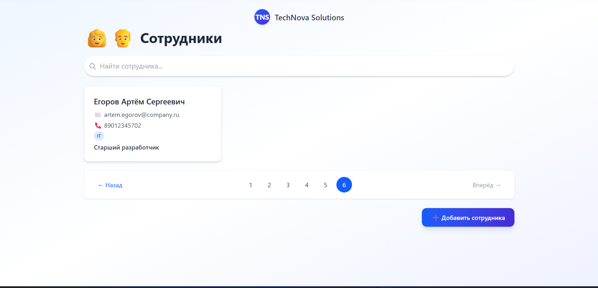
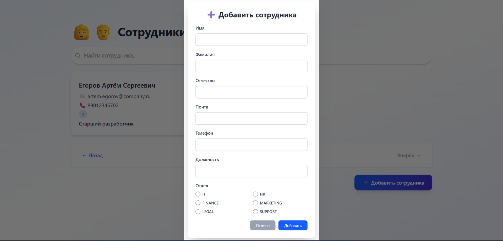
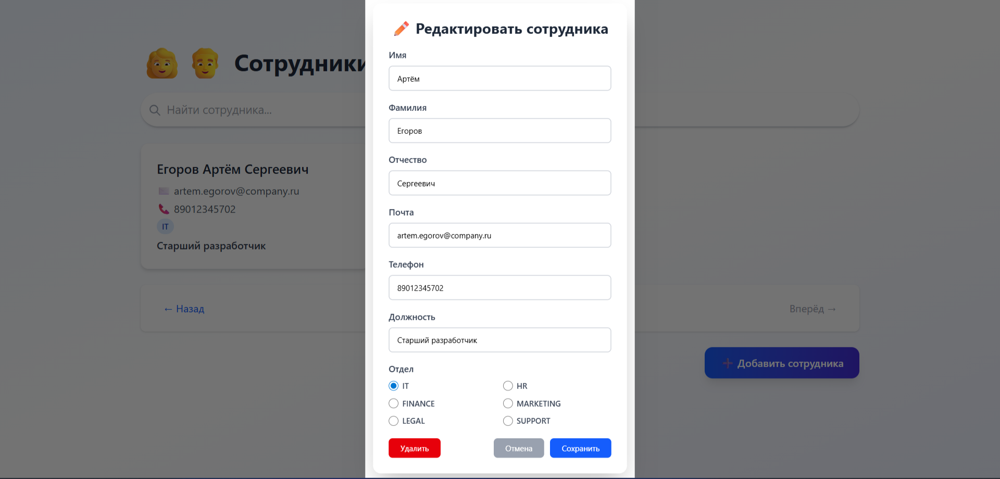
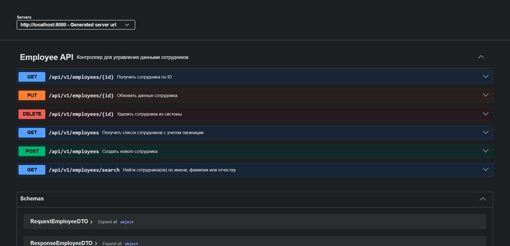
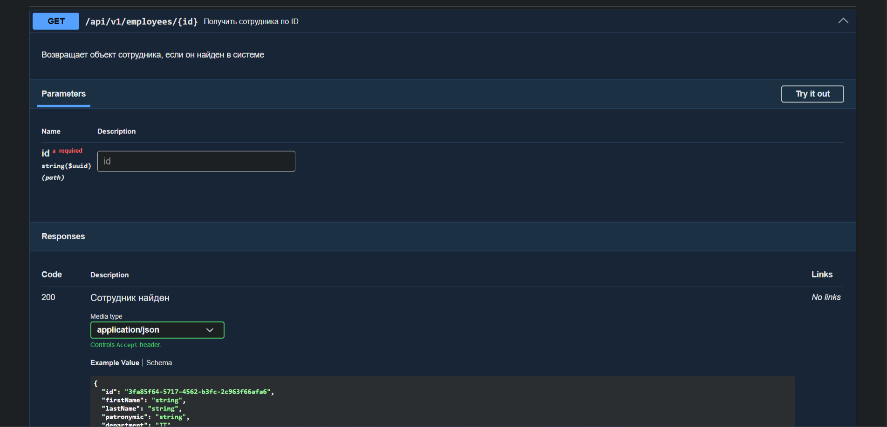

# 🏢 Employee Management System
Этот простой проект представляет собой веб-приложение для управления сотрудниками
с использованием современного стека: **Spring Boot + React + PostgreSQL + Docker**.

---

## Описание

Проект позволяет:
- Просматривать, добавлять, редактировать и удалять сотрудников
- Искать по ФИО
- Управлять данными через удобный пользовательский интерфейс

## 🛠 Технологический стек

| Компонент            | Технология                           |
|----------------------|--------------------------------------|
| **Бэкенд**           | Java 25, Spring Boot 4.1.0, JPA, WEB |
| **Фронтенд**         | React, Vite, Tailwind CSS            |
| **База данных**      | PostgreSQL                           |
| **Админ-панель БД**  | pgAdmin                              |
| **Сборка**           | Docker + Docker Compose              |
| **ORM / Миграции**   | Hibernate + Liquibase                |
| **Документация API** | OpenAPI 3 (через springdoc-openapi)  |
| **Упрощение кода**   | Lombok                               |
---

## 📚 Документация API (OpenAPI)

Проект использует [`springdoc-openapi-starter-webmvc-ui`](https://springdoc.org) для автоматической генерации интерактивной документации API на основе OpenAPI 3.

После запуска приложения вы можете:
- Просматривать все доступные эндпоинты
- Проверять параметры запросов и ответов
- Прямо из браузера выполнять запросы

### 🔗 Адреса документации:

| Назначение                      | URL                                                                            |
|---------------------------------|--------------------------------------------------------------------------------|
| **Swagger UI (интерактивная)**  | [http://localhost:8080/swagger-ui.html](http://localhost:8080/swagger-ui.html) |
| **OpenAPI спецификация (JSON)** | [http://localhost:8080/v3/api-docs](http://localhost:8080/v3/api-docs)         |

## 🚀 Запуск проекта

### Предварительные требования
- [Docker](https://docs.docker.com/get-docker/) и [Docker Compose](https://docs.docker.com/compose/install/)
- (Опционально) Java 25, Node.js — если хотите запускать локально без Docker

### 1. Клонируйте репозиторий

git clone https://github.com/EgorMalykh/CRMEmployee.git 

cd CRMEmployee

### 2. Запустите всё одной командой

docker-compose up --build

> Первый запуск займёт несколько минут — скачиваются образы и собираются сервисы.

---

## 🔗 Адреса сервисов

| Сервис         | URL                                                                              | Логин / Пароль                       |
|----------------|----------------------------------------------------------------------------------|--------------------------------------|
| **Фронтенд**   | [http://localhost:5173](http://localhost:5173)                                   | —                                    |
| **Бэкенд API** | [http://localhost:8080/api/v1/employees](http://localhost:8080/api/v1/employees) | —                                    |
| **pgAdmin**    | [http://localhost:5050](http://localhost:5050)                                   | `admin@admin.com` / `root`           |
| **PostgreSQL** | `postgres:5432` (внутри сети Docker)                                             | `admin` / `admin`, БД: `employee_db` |

> В pgAdmin сервер уже добавлен автоматически через `servers.json`.

---

## 📄 Лицензия

MIT License — свободное использование, модификация, распространение.

---

Разработано с ❤️